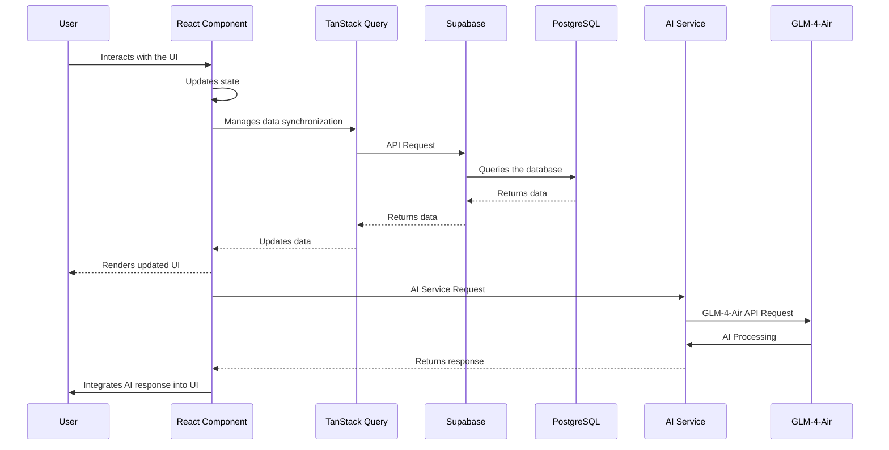

# Project Documentation

This document provides a comprehensive overview of the project's architecture, features, and implementation details.

## Table of Contents

*   [Architecture](#architecture)
*   [Frontend](#frontend)
*   [Backend](#backend)
*   [Features](#features)

## Architecture

Below is a Mermaid diagram illustrating the data flow architecture of the application.

