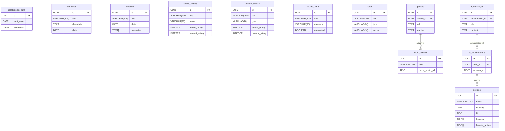

<div align="center">
  
  <h1>💖 Tomoe & Nanami - A Romantic Journey 💖</h1>
  
  <blockquote>
    <p><em>"In your eyes, I found my home" 💕</em></p>
    <p>A beautifully crafted Progressive Web App for couples to celebrate their love story, create lasting memories, and deepen their connection through modern technology and AI-powered features.</p>
  </blockquote>
  
  <p>
    <a href="https://github.com/your_username/tomoe-nanami-romantic-app">
      
    </a>
    <a href="https://reactjs.org/">
      
    </a>
    <a href="https://www.typescriptlang.org/">
      
    </a>
    <a href="https://supabase.io/">
      
    </a>
    <a href="https://web.dev/progressive-web-apps/">
      
    </a>
    <a href="https://open.bigmodel.cn/">
      
    </a>
  </p>
  
  <p>
    <a href="#-overview-">✨ Overview</a> • 
    <a href="#-features-">💕 Features</a> • 
    <a href="#-technology-stack-">🛠️ Tech Stack</a> • 
    <a href="#-getting-started-">🚀 Getting Started</a> • 
    <a href="#-system-architecture-">🏗️ Architecture</a> •
    <a href="#-database-schema-">🗃️ Database Schema</a>
  </p>
</div>

---

## ✨ Overview

**Tomoe & Nanami** is a comprehensive romantic companion app designed specifically for couples to document, celebrate, and enhance their relationship journey. Built with modern web technologies and powered by AI, this PWA (Progressive Web App) offers an immersive, app-like experience that can be installed on mobile devices.

### 🎯 Core Philosophy

This application transforms digital technology into a romantic companion that:
- **Celebrates**: Every milestone and memory.
- **Enhances**: Connection through interactive features.
- **Preserves**: Love stories for future generations.
- **Adapts**: To each couple's unique journey.
- **Grows**: With the relationship over time.

---

## 💕 Features

### 📅 Relationship Tracking
- **Real-time Relationship Counter**: Track days, months, and years together.
- **Interactive Timeline**: Visualize your journey with significant moments.
- **Birthday & Anniversary Tracking**: Never miss a special date.
- **Milestone Celebrations**: Mark and celebrate relationship achievements.

### 🤖 AI-Powered Photo Management
- **Smart Photo Organization**: AI analyzes and categorizes your memories.
- **Automatic Tagging**: Intelligent photo tagging and mood detection.
- **Album Creation**: Create themed photo albums with AI suggestions.
- **Photo Insights**: Get AI-generated descriptions and memory suggestions.

### 🧠 AI Companion
- **Relationship Insights**: Personalized advice based on your activity patterns.
- **Date Idea Generator**: AI-powered suggestions tailored to your preferences.
- **Anniversary Assistant**: Help planning special celebrations.
- **Memory Organizer**: Automatically organize and suggest photo albums.

---

## 🛠️ Technology Stack

| Category                  | Technology                                                                                                                                                             |
| ------------------------- | ---------------------------------------------------------------------------------------------------------------------------------------------------------------------- |
| **Frontend Framework**    | [React 18.3.1](https://reactjs.org/), [TypeScript 5.8.3](https://www.typescriptlang.org/), [Vite 5.4.19](https://vitejs.dev/)                                              |
| **UI & Styling**          | [Tailwind CSS 3.4.17](https://tailwindcss.com/), [Shadcn/UI](https://ui.shadcn.com/), [Radix UI](https://www.radix-ui.com/), [Framer Motion 12.23.12](https://www.framer.com/motion/) |
| **Backend & Database**    | [Supabase 2.56.0](https://supabase.io/), [PostgreSQL](https://www.postgresql.org/), [Supabase Auth](https://supabase.com/docs/guides/auth)                                 |
| **State & Data Fetching** | [TanStack React Query 5.83.0](https://tanstack.com/query/latest), [React Hook Form 7.61.1](https://react-hook-form.com/), [Zod 3.25.76](https://zod.dev/)                  |
| **AI Integration**        | [GLM-4-Air](https://open.bigmodel.cn/), Custom AI Service                                                                                                               |
| **PWA & Mobile**          | Service Worker, Web App Manifest, Touch Gestures                                                                                                                       |
| **Development Tools**     | [ESLint 9.32.0](https://eslint.org/), [TypeScript ESLint](https://typescript-eslint.io/), [Bun 1.1.9](https://bun.sh/)                                                    |

---

## 🚀 Getting Started

### Prerequisites
- Node.js 18.x or higher
- Bun 1.1.9 or higher (recommended)
- A [Supabase](https://supabase.com) account

### Installation & Setup

1.  **Clone the repository:**
    ```bash
    git clone https://github.com/your_username/tomoe-nanami-romantic-app.git
    cd tomoe-nanami-romantic-app
    ```

2.  **Install dependencies:**
    ```bash
    # Using Bun (recommended)
    bun install

    # Or using npm
    npm install
    ```

3.  **Set up environment variables:**
    Copy the example environment file and fill in your Supabase and GLM API credentials.
    ```bash
    cp .env.example .env
    ```

4.  **Set up the database:**
    Execute the SQL commands in `database/schema.sql` in your Supabase SQL editor to create the necessary tables.

5.  **Run the application:**
    ```bash
    bun run dev
    ```
    The application will be available at `http://localhost:8080`.

---

## 🏗️ System Architecture

This diagram illustrates the high-level architecture of the application, from the user interface to the backend services.


---

## 🗃️ Database Schema

The following Entity-Relationship Diagram (ERD) outlines the structure of the PostgreSQL database.



---

## 🤝 Contributing

We welcome contributions to make Tomoe & Nanami even more special! Please see our contributing guidelines and code of conduct.

## 📄 License

This project is licensed under the MIT License - see the LICENSE file for details.

## 🙏 Acknowledgments

- **Tomoe & Nanami** - The inspiration behind every feature
- **Supabase** - For the amazing backend infrastructure
- **Shadcn/UI** - For beautiful, accessible components
- **GLM AI** - For powering our AI features
- **React & TypeScript communities** - For the incredible tools

---

<div align="center">
  <h3> Made with ❤️ for couples everywhere </h3>
  
  <p><em>"Every love story is beautiful, but yours deserves to be celebrated in the most special way possible."</em></p>
  
  <p>🌸 💕 🌸 💕 🌸</p>
</div>
